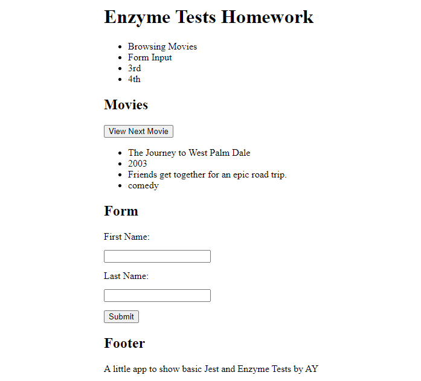
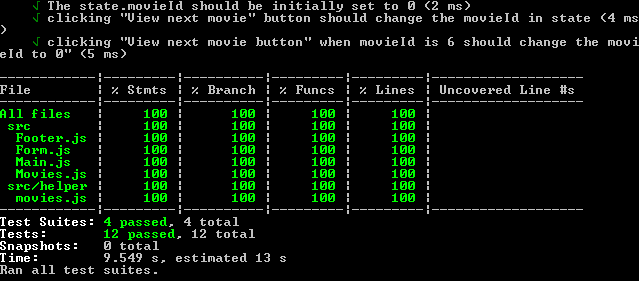

# Enzyme Test Homework

This project uses Jest and Enzyme to test some basic React Components.
I wanted to test common components, so I tested one that renders basic dummy data, a basic
form and a test to check if props are passed to another component.

